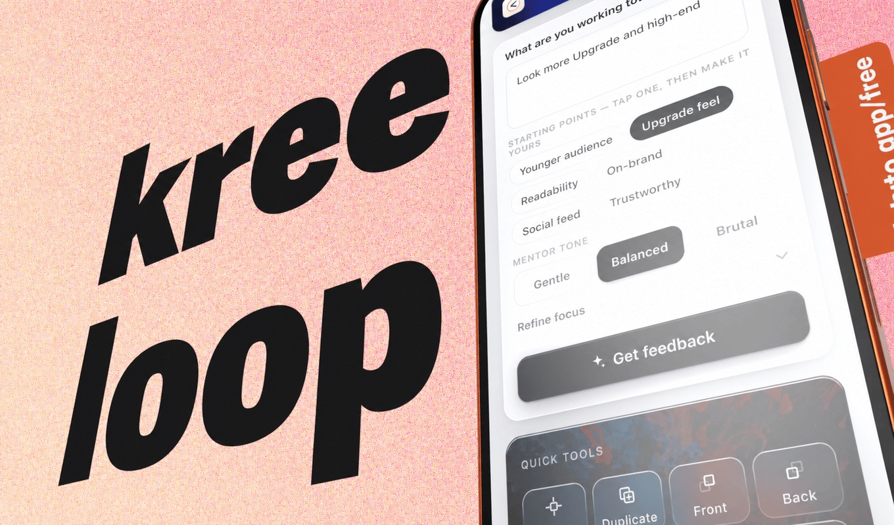

An AI design mentor that runs inside Adobe Express. You say what the design is for; it reads the
page, measures what can actually be measured, and answers with a score, six craft ratings, fixes
that apply to the canvas in one tap, and a palette pulled out of your own design.

**[Install it from the Adobe Express marketplace](https://adobesparkpost.app.link/TR9Mb7TXFLb?addOnId=wlnj499hh)**

## What this repository is

Not the product.

Nearly all of the difficulty in building this was Adobe-specific. The document model refuses things
in ways the documentation does not spell out, and every refusal eventually reaches a person as a
sentence that either helps them or makes the add-on look broken. Nine review rounds were mostly
spent learning the difference.

That knowledge is the part worth publishing, so it is here: a handful of small modules, rewritten
from principles rather than lifted out of the product, each one solving a problem that cost a
review round. You can read any of them in a sitting and run all of them with `node`.

What makes Kreeloop itself — the panel, the prompt system, the measurement rules, the proxy that
holds the API keys — is not here and will not be.

## Where your code runs

Three places, and most early mistakes come from not knowing which one you are in.

```
Adobe Express
│
├── panel — an iframe              your HTML and JS. No access to the scene graph.
│     addOnUISdk                   renditions, drag to canvas, client storage, theme, dialogs
│           ↕                      runtime proxy: async, and plain data only
├── document sandbox               your JS, holding the scene graph. No DOM, no network.
│     express-document-sdk         nodes, text, media frames, grids, edits
│
└── the canvas the user is looking at

your own server — optional        anything with a secret in it: API keys, model calls
```

One manifest entry point wires the first two together:

```json
{ "type": "panel", "id": "panel1", "main": "index.html", "documentSandbox": "sandbox/code.js" }
```

The sandbox calls `runtime.exposeApi({ ... })`; the panel picks it up with
`runtime.apiProxy("documentSandbox")` and calls those methods as promises.

**That boundary carries plain data and nothing else.** Return a live node or any class instance
from an exposed method and the call is rejected *after* your edit has already run — the document
changes and the panel is told it failed. `patterns/bridge.js` is the defence: one wrapper around
the whole API object that catches sync throws and rejected promises, copies every return value to
plain data, and turns failures into named reasons.

## What actually breaks

Each of these shipped as a bug at least once. The module beside it is the fix, generalised.

**A photo refuses to move, and the message blames the user.**
The user selects the image. The thing that has a position, a rotation, siblings and a shape is the
`MediaContainerNode` wrapped around it, which has no `children` at all. Every tool that walks the
tree has to retarget before acting. → `patterns/node-types.js`

**Positions come back in the wrong space.**
A node inside a group reports its position in group coordinates. Do arithmetic on those numbers and
you will confidently tell someone their headline sits at the top of the page when it does not.
Convert into the artboard's space first. → `patterns/coordinates.js`

**Artboards look movable and are not.**
`translation`, `boundsInParent`, `boundsInNode` and `setPositionInParent` are declared on `Node`.
`ArtboardNode` extends `VisualNode` and `PageNode` extends `BaseNode`, so neither can be moved or
measured that way — and both expose `width` and `height`, which is exactly what tempts a walk-up
the tree into picking one. → `patterns/coordinates.js`

**`layout.type === "autoWidth"` is always false.**
`TextLayout` is a numeric enum: area 1, autoHeight 2, autoWidth 3, circular 4, magicFit 5 — and
the last two are real, so a two-branch check is already wrong. `TextAlignment` is another: left 1,
right 2, center 3. Compare against the string and a feature quietly does nothing, while every test
that stubs the field as a string keeps passing. Read the values from `constants` by name.
→ `patterns/node-types.js`

**Capturing the page fails for reasons that have nothing to do with the page.**
`createRenditions` with the export intent throws on a free plan when the page uses paid template
content, and raises an approval dialog on a document that is under review. The preview intent is
always allowed and costs one manifest flag, `"renditionPreview": true`. `RenditionFormat` is png,
jpg, mp4, pdf and pptx — the last two take their own options objects — and `requestedSize` applies
only to the image formats, where it is a desired size, so asking for more than the page has
upscales it. → `patterns/renditions.js`

**Undo reverses a different edit than the one you just made.**
Stack depth stops being identity the moment the stack is capped, and asking "does this node still
exist" by searching the current page marks every entry stale as soon as the user changes page. Keep
a sequence number and the node references you resolved when you pushed. → `patterns/undo.js`

**A white headline on a dark photo is measured as 1.00:1 against #ffffff.**
Text contrast taken against "the page colour", when the text actually sits on a photograph,
produces a confident 1.00:1 and a one-tap fix that buries the text in the image. Resolve what is
really behind the element, and when that cannot be resolved, say so and measure nothing.
→ `patterns/contrast.js`

## Testing when you cannot open Adobe Express

An add-on runs inside a product you cannot script, so the tests run the real module code against a
stub of the document model. The rule that makes this worth doing:

> A stub that models a more permissive world than the SDK is worse than no stub, because the suite
> stays green over a feature that cannot work.

`testing/stub.js` is therefore built to refuse what the real thing refuses: artboards and pages
have no `translation` or `setPositionInParent`, media frames and grids have no `children`, a grid
cell's `cloneInPlace` throws the way the typings say it does, colours cannot be copied with a
spread, the enums carry their real numeric values, and `applyCharacterStyles` honours its optional
range argument instead of painting the whole text flow.

```
node testing/run.js
```

That runs 140 assertions against the modules in `patterns/`, and every one of them has been watched
failing: change a WCAG floor, flip a division in the sRGB curve or drop a guard and the run goes red.

The same approach scales past this repository: the private build drives the real panel in headless
Chrome over CDP at 356×700 — a true Express panel size — and measures text contrast from decoded
screenshot pixels rather than from the colours it thinks it rendered. 762 assertions ran before the
build that was approved.

## What is not in here

The panel UI and its state machine. The prompt system: how the model is asked, constrained to a
schema, and what happens when it answers badly. The measurement rules that decide what counts as a
defect. The server: key pool, rotation, model pinning, retry budget, quota accounting, caching.
Anything from the listing or the review correspondence.

Two reasons. It is a live product, and a complete copy of an add-on teaches nobody anything.



## What nine rounds actually taught

A control must never claim something the user cannot see happen. Most of the rejections reduce to
that one sentence wearing different costumes: a button that said "applied" over a canvas where
nothing moved, a batch that re-armed itself with nothing left to do, a tool that said "that text
already fits" about text hanging off the page.

Give every refusal its own message. One catch-all sentence covered six different causes here, and
because a recording could not tell them apart, the first fix was written against a theory and was
wrong. Six causes, six sentences — then a screenshot from a reviewer becomes a diagnosis.

Reproduce a defect before fixing it, then put the bug back and watch the test fail. A test that has
never been seen failing is not a test.

Measure, then speak. Anything you can compute — a contrast ratio, a margin, a type scale — should
arrive with its number attached, and anything you cannot compute should be said plainly rather than
estimated by a language model that will happily agree with itself.

## Using this

No licence is granted. Read it, learn from it, rewrite the ideas in your own code. Do not ship it
as your own add-on.
